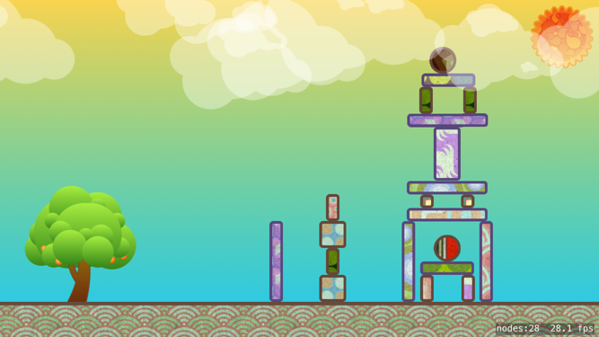
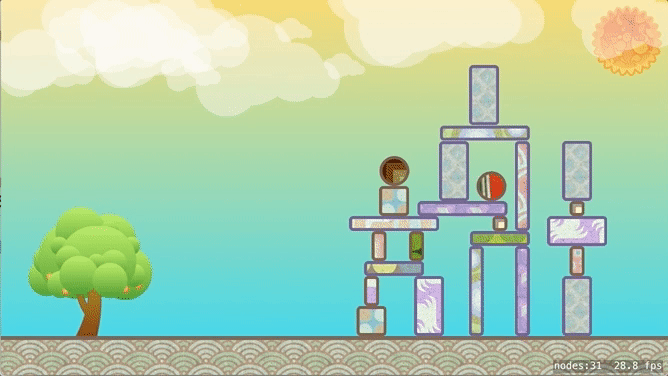

# Orange Tree

This is a physics based game like Angry Birds. This is an introductory tutorial on Swift
and SpriteKit. 



When you're done the game should look something like this: 



Resources for this project are located here: [Smashing-Things.atlas](Smashing-Things.atlas.zip)

## Make a new Xcode project

- make a new Xcode project choose SpriteKit as the Template. 

## Set up the project

- Delete Actions.sks.
- Drag 'Smashing-Things.atlas' into the project navigator.
- Open GameScene.sks and delete objects there. 
    - Set width: 1334
    - Height: 750

## Build A scene with SpriteNodes

Drag items from the Media Library into the scene and set the settings for each item shown
below. 

- background
    - z-position: -2
- OrangeTree
    - z-position: -1
    - name: OrangeTree
- Ground
    - Physics Body: Bounding Rectangle
        - Uncheck, Dynamic, Affected by Gravity, Allows Rotation

### Build some structures

Now build some structures to knock over. All of these objects need to have a Physics Body!
If you make one and set the settings you can copy it with settings to make another. 
Hold Option and drag to copy.

You can rotate blocks. Hold shift rotate in 45˚ increments. 

- All blocks should have the following settings
    - Physics Body: Bounding Rectangle
    
## GameScene.swift 

This file holds the code that runs the game. There is a lot of default code which you 
do not need. 

- Delete all of the default code. 

### Define the GameScene Class: 

When adding code be sure to take advantage of code hints, and completion! Rather than 
typing all every character, always start typing the name of a function, and let Xcode 
give show you some hints, choose what you are looking for from the menu and hit return. 

Tab between parameters as you fill them. 

```
import SpriteKit

class GameScene: SKScene {
    
}
```

### Add an Orange

Let's make the Orange from code. Add a class file to define the Orange. File new File, 
then choose Swift file. 

- Name the File: Orange

Add the following, besure to let Xcode fill in as much as you can get it to! 

```
import SpriteKit

class Orange: SKSpriteNode {
    init() {
        let texture = SKTexture(imageNamed: "Orange")
        let size = texture.size()
        let color = UIColor.clear
        
        super.init(texture: texture, color: color, size: size)
        
        physicsBody = SKPhysicsBody(circleOfRadius: size.width / 2)
    }
    
    required init?(coder aDecoder: NSCoder) {
        fatalError("init(coder:) has not been implemented")
    }
}
```

### Fire some Oranges!

Open GameScene.swift. All of the following will go inside the GameScene class. 

#### Add some vars 

Add this at the top. 

```
var orangeTree: SKSpriteNode!
var orange: Orange?
```

#### didMove(to view:) 

Use the didMove(to view:) method initialize your scene. 

You can get references to objects in GameScene.sks using child

```
override func didMove(to view: SKView) {
    orangeTree = childNode(withName: "OrangeTree") as! SKSpriteNode
}
```

#### touchesBegan(_ touches: with event:) 

This method detects when your finger makes contact with the screen. We need to get the 
location of the touch, create an Orange and position it at that location. 

Next we need to give the `orange` an impulse to make fly forward. 

```
override func touchesBegan(_ touches: Set<UITouch>, with event: UIEvent?) {
    let touch = touches.first!
    let location = touch.location(in: self)
    if atPoint(location).name == "OrangeTree" {
        orange = Orange()
        addChild(orange!)
        orange?.position = location
        let vector = CGVector(dx: 100, dy: 0)
        orange?.physicsBody?.applyImpulse(vector)
    }
}
```

## Improving the game

Here you will remove some of the previous code and replace it to make a better game. 
The new code will allow us to drag and fire an Orange at any angle. 

This system will require create an Orange when a touch begins, move the orange to follow 
your finger as the touch moves, then fire the orange when the touch ends. 

To generate the launch vector we need to know the position where the touch began. 
Add this variable at the top of the GameScene class: 

`var touchStart: CGPoint = CGPoint.zero`

### New touchesBegan(_ touches: with event:)

Note the changes! Setting the physics body of the orange to `isDynamic = false` allows it 
to ignore the effects of gravity and other physics interactions as we drag it. 

```
override func touchesBegan(_ touches: Set<UITouch>, with event: UIEvent?) {
    let touch = touches.first!
    let location = touch.location(in: self)
    if atPoint(location).name == "OrangeTree" {
        orange = Orange()
        addChild(orange!)
        orange?.position = location
        orange?.physicsBody?.isDynamic = false
        touchStart = location
    }
}
```

### touchesMoved(_ touch: with event:) 

Here you need to get the touch, then find the location of the touch in this view. 
Then position the orange at that location. 

```
override func touchesMoved(_ touches: Set<UITouch>, with event: UIEvent?) {
    let touch = touches.first!
    let location = touch.location(in: self)
    orange?.position = location
}
```

### touchesEnded(_ touches: with event:)

Here you launch the orange by setting it's `isDynamic` property to `true` and then 
applying an impulse to it's `physicsBody`. 

The impulse is applied on a vector. You need to calculate the vector by taking the 
difference of the starting x and x location of the touch when it ended, and doing 
the same with the y. This is calculated below as `dx` and `dy`. 

```
override func touchesEnded(_ touches: Set<UITouch>, with event: UIEvent?) {
    let touch = touches.first!
    let location = touch.location(in: self)
    let dx = (touchStart.x - location.x)
    let dy = (touchStart.y - location.y)
    let vector = CGVector(dx: dx, dy: dy)
    orange?.physicsBody?.isDynamic = true
    orange?.physicsBody?.applyImpulse(vector)
}
```

## Show a Launch vector

Might be nice to draw a line showing the angle to launch an orange. 

### SKShapeNode 

Use an SKShapeNode. Add a shape node and draw a line in touches moved. 

Add a var to hold the shape node. Add this to the top of the `GameScene` class. 

`var shapeNode = SKShapeNode()`

### Configure the shape node

Add this to didMove(to view:)

```
addChild(shapeNode)
shapeNode.lineWidth = 20
shapeNode.lineCap = .round
shapeNode.strokeColor = UIColor(white: 1, alpha: 0.3)
```

### Draw a line

Draw a line by moving to the starting point, then adding a line. Add the following to 
touchesMoved(_ touches: with event:) at the end of the method:

```
let path = UIBezierPath()
path.move(to: touchStart)
path.addLine(to: location)
shapeNode.path = path.cgPath
```

### Remove the path

Remove the path, not the shape, when touches end. Add the following to 
touchesEnded(_ touches: with event:) at the end of the method:

`shapeNode.path = nil`


## Particles

Particles are systems that animate and manage many objects with some mathematical rules. 
Use particles to create special effects like Smoke, Fire, Bubbles, and more. 

You can add a nice background effect of clouds floating by using particles. 

- Add a new file. Choose: SpriteKit Particle File
    - Choose: Fire
    - Name this file: CloudsEmitter

You should see a preview of the emitter. Set these properties: 

- Texture: CloudOne
- Birthrate: 0.2
- Lifetime: 200
- Position Range x: -200 y: 150
- Angle Start: 0 Range: 0
- Speed Start: 10 Range: 5
- Alpha Start: 33 Range: 0.2 Speed: 0
- Scale Start: 0.25 Range: 0.2 Speed: 0
- Rotation Start: 0 Speed: 0
- Color Blend Factor: 1 Range: 0 Speed: 0
- Color Ramp: Set the color to White
- Blend mode: Alpha

### Add an SKEmitter

Add your particle to the scene by creating an instance of SKEmitter. Add the following 
to `didMove(to view:)` in GameScene.swift:

```
if let clouds = SKEmitterNode(fileNamed: "CloudEmitter") {
    addChild(clouds)
    clouds.position.x = -800
    clouds.position.y = 300
    clouds.zPosition = 0
    clouds.advanceSimulationTime(160)
}
```   

## Making more levels 

An SKScene can be loaded with any .sks file. This means you can use GameScene.swift
with Level_1.sks, and Level_2.sks. 

Your .sks files will need to have all of the objects your Scene.swift file expects!

Add a class method to load .sks files.


```
static func Load(level: Int) -> GameScene? {
    return GameScene(fileNamed: "Level_\(level)")
}
```

Call this method on the GameScene class with the number of the level to load and it 
returns GameScene initialized with that Level sks file. 

Change the name of GameScene.sks to Level_1.sks. 

You'll need to change the way GameScene is first loaded in GameViewController.swift. 

Change: `if let scene = SKScene(fileNamed: "GameScene") {` 
to: `if let scene = GameScene.Load(level: 1) {`

This should load GameScene.swift with Level_1.sks. 

All scene levels will be named Level_#.sks where # will be an integer: 1, 2, 3 etc. 

### Make a new Level

Make a new level. Do it the same way you did at the very beginning of the tutorial. 

Named elements will have to have the same names! For example: OrangeTree will have to 
have the name: OrangeTree in the new level. 

Use the same Physics settings and options to get the same effect. 

The easiest way to create a new level is to duplicate the previous level and modify it. 
Select Level_1.sks in the project outline and choose File > Duplicate. Name the new 
file Level_2.sks

Afte making a new level test it by changing the in GameViewController.swift from 1 to 2: 

`if let scene = GameScene.Load(level: 2) {`

## SKActions 

SKActions do things, almost everything you can think of. They really flexible, you can 
probably make entire games built only on SKAction!

Add add the Sun image to your scene, give it the name: "Sun". You'll use this as a 
"button". 

How about loading a random level.

```
else if atPoint(location).name == "Sun" {
    print("Random level button")
    let n = Int(arc4random() % 3 + 1)
    if let scene = GameScene.Load(level: n) {
        scene.scaleMode = .aspectFill
        if let view = view {
            view.presentScene(scene)
        }
    }
}
```

I had 3 levels in my example. Change the number 3 above to the number of levels you have. 

When I created this example the clouds covered the Sun not allowing touch events to pass 
through to the Sun. I fixed this after creating clouds in `didMove()`: 

`clouds.isUserInteractionEnabled = false`


